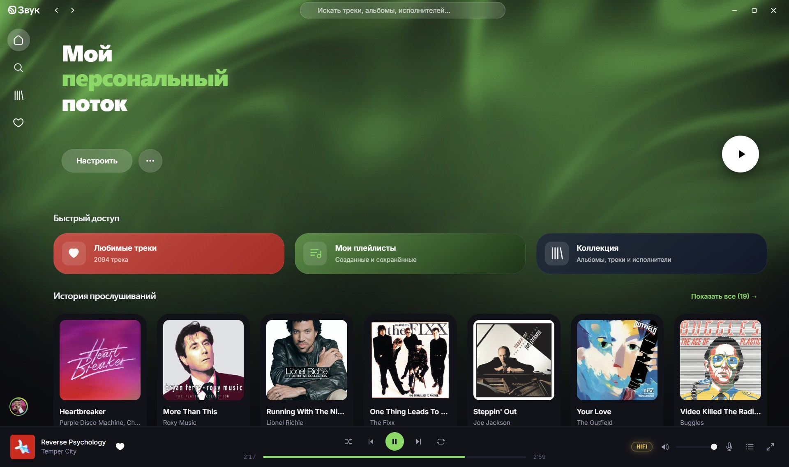
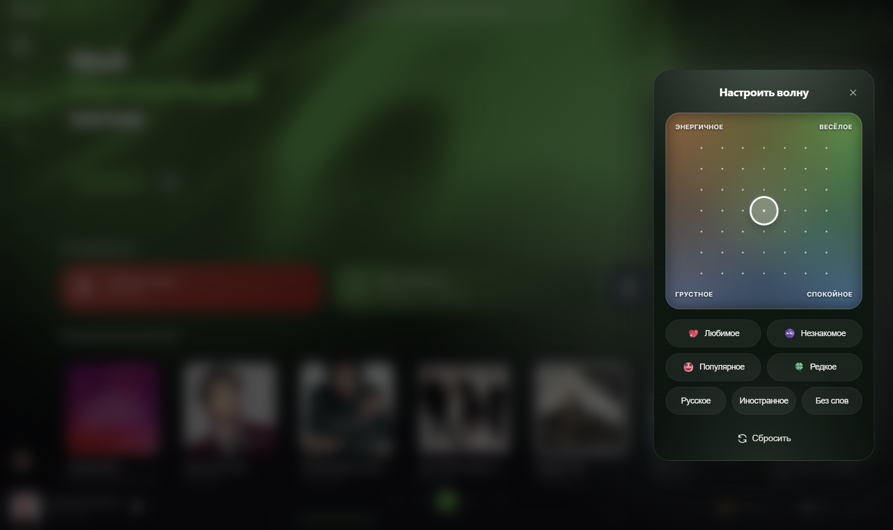
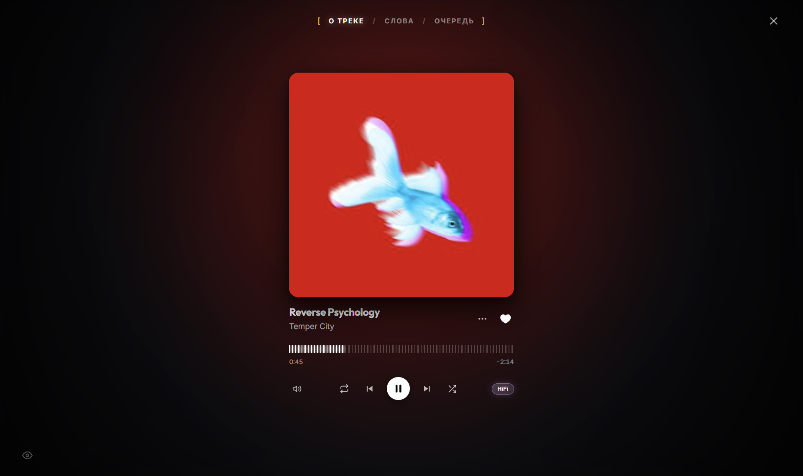
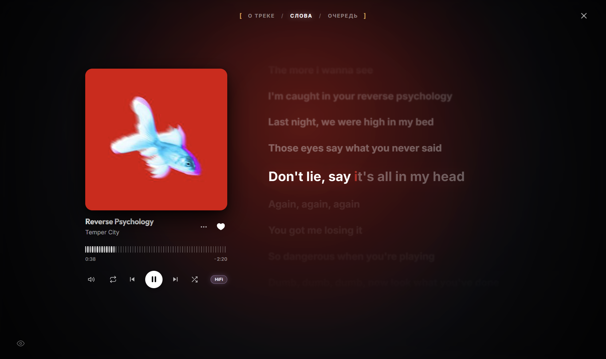
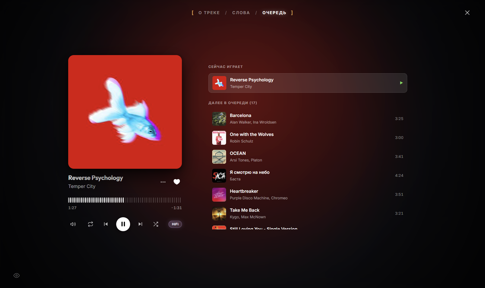
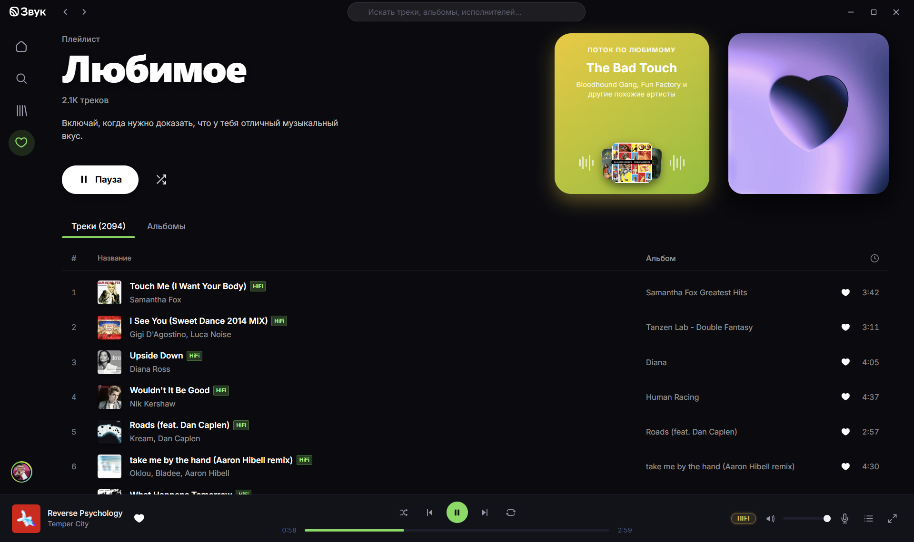
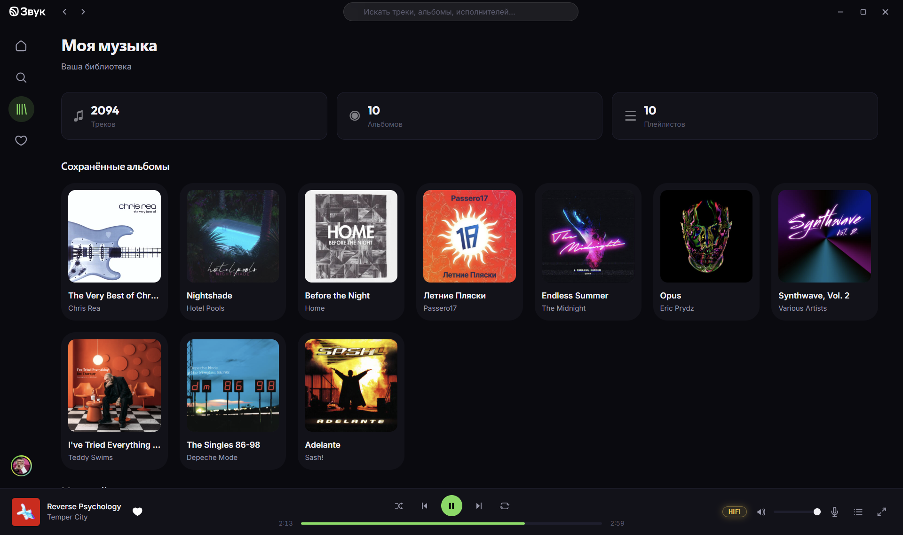
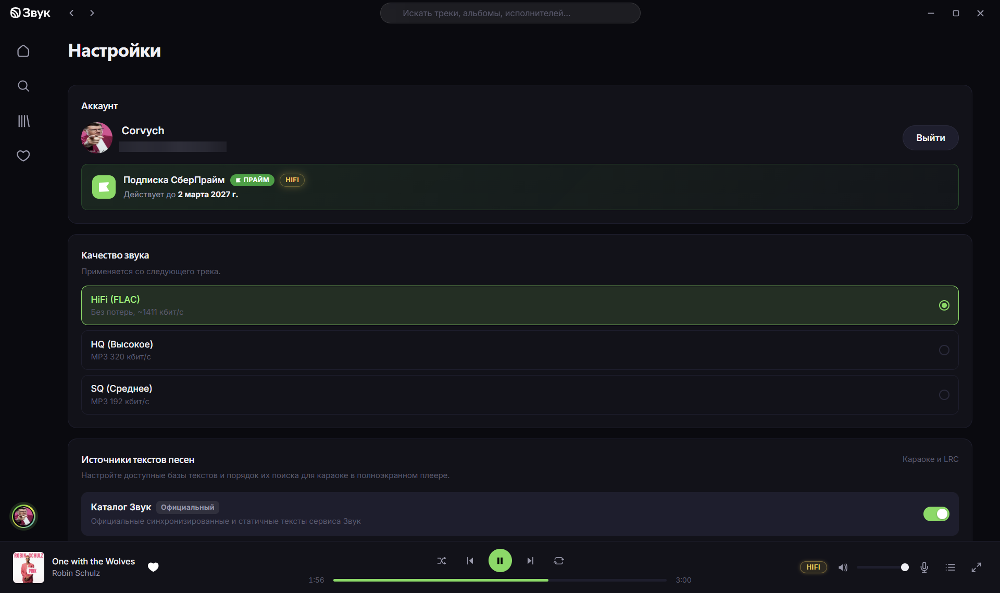

<p align="center">
  
</p>

<h1 align="center">Zvuk Desktop</h1>

<p align="center">
  <b>Неофициальный</b>, но современный, производительный и легковесный десктоп-клиент для стримингового сервиса «Звук»
</p>

<p align="center">
  Полноценный опыт прослушивания музыки с поддержкой <b>Hi-Fi FLAC</b>, синхронизированными текстами караоке, аудиореактивными визуализациями и адаптивной темой Monet.
</p>

<p align="center">
  
  
  
  
  
  
  
</p>



---

## 💡 О проекте

У стримингового сервиса «Звук» на данный момент нет официального десктопного приложения — слушать музыку приходится через веб-браузер. Однако для повседневного использования за компьютером отдельное приложение гораздо удобнее: вкладка не теряется среди десятков рабочих страниц, мультимедийные клавиши клавиатуры и оверлей Windows работают стабильно, а управление воспроизведением доступно даже во время игр или работы в других программах.

**Zvuk Desktop** призван закрыть эту потребность и предоставить первоклассный нативный опыт:
- **Автономность и комфорт**: отдельное окно, глобальные хоткеи, интеграция с системным MediaSession и безопасное хранилище ключей ОС.
- **Легковесность и скорость**: связка **Tauri 2** и **Rust** потребляет значительно меньше оперативной памяти и ресурсов процессора, чем открытая вкладка браузера или громоздкие клиенты на Electron.
- **Плавный и отзывчивый UI**: интерфейс на **React 19** и **TypeScript** обеспечивает быстрый отклик (60+ FPS) и моментальный поиск по каталогу.

---

## ✨ Ключевые возможности

### 🎧 Безупречный звук без потерь (Lossless Hi-Fi)
- **Hi-Fi качество (FLAC, ~1411 кбит/с)** — оригинальный несжатый студийный звук для настоящих аудиофилов.
- **HQ (320 кбит/с)** и **SQ (192 кбит/с)** — быстрое переключение битрейта для экономии трафика.
- Мгновенная буферизация и воспроизведение треков без задержек.

### 🎤 Синхронизированные тексты песен и караоке
- **Двухдвижковая система**: официальный каталог «Звук» + открытая база **LRCLIB** (.lrc).
- Синхронная подсветка текущей строки в такт треку.
- **Интерактивная навигация**: клик по любой строке текста мгновенно перематывает воспроизведение на нужный момент.
- Настраиваемый приоритет источников в настройках приложения.

### 🌌 Аудиореактивная визуализация и динамическая палитра Monet
- **Monet Theme Engine**: автоматический колорпикер извлекает ключевые оттенки из обложки текущего альбома и гармонично подстраивает акценты интерфейса (Material You style).
- **Aurora Shader Canvas**: WebGL-шейдер «живой авроры», в реальном времени пульсирующий под низкие и средние частоты трека.
- **Полноэкранный плеер (`F`)**: эстетичный режим для отдыха с крупным кавером, синхронным текстом и визуализатором.
- **Dashed Ruler Progress Bar**: тактильный таймлайн с микросекундной точностью перемотки.

### ⚡ «Сила Звука» (Персональная волна)
- Бесконечный поток умных рекомендаций, обучающийся на ваших лайках и прослушиваниях.
- **Интерактивный тюнер**: тонкая настройка потока (настроение, темп/энергия, новизна треков, популярность).
- Радио по любому артисту или треку в один клик.

### 📚 Медиатека и плейлисты
- Быстрый доступ к **Любимым трекам**, **Альбомам** и **Артистам**.
- Создание, редактирование и удаление собственных плейлистов.
- Подборки от редакции сервиса, новинки, чарты и жанровые категории.
- Динамический поиск с моментальным автокомплитом артистов, треков, альбомов и плейлистов.

### 🔐 Безопасность и Сбер ID
- Вход через **Сбер ID**.
- Токены доступа сохраняются в нативном системном хранилище учетных данных (**Windows Credential Manager / Keyring**), а не в небезопасном LocalStorage.
- Автоматическая проверка активной подписки **СберПрайм** и отображение статуса профиля.

### 🎛️ Нативный десктопный опыт
- **Кастомный безрамочный интерфейс** (Frameless Window) с удобными кнопками управления окном.
- **MediaSession API**: интеграция с мультимедийными клавишами клавиатуры и системным оверлеем Windows (громкость, название трека, обложка, кнопки управления).
- **Глобальные горячие клавиши**, поддерживающие обе раскладки клавиатуры (**EN** и **RU**).

---

## 📸 Скриншоты

| | |
|:---:|:---:|
| **Главная страница**<br><br> | **Тюнер волны «Сила Звука»**<br><br> |
| **Полноэкранный плеер**<br><br> | **Синхронизированные тексты (Караоке)**<br><br> |
| **Очередь воспроизведения**<br><br> | **Любимые треки**<br><br> |
| **Коллекция и медиатека**<br><br> | **Настройки приложения**<br><br> |

---

## ⌨️ Горячие клавиши

| Клавиша (EN / RU) | Действие |
| :---: | :--- |
| <kbd>Space</kbd> | Воспроизведение / Пауза |
| <kbd>L</kbd> / <kbd>Д</kbd> | Добавить / убрать из «Любимого» (Лайк) |
| <kbd>F</kbd> / <kbd>А</kbd> | Полноэкранный плеер (режим обложки / караоке) |
| <kbd>→</kbd> / <kbd>←</kbd> | Перемотка вперед / назад на 5 секунд |
| <kbd>Shift</kbd> + <kbd>→</kbd> / <kbd>←</kbd> | Следующий / предыдущий трек |
| <kbd>↑</kbd> / <kbd>↓</kbd> | Громкость +5% / −5% |
| <kbd>M</kbd> / <kbd>Ь</kbd> | Включить / выключить звук (Mute) |
| <kbd>S</kbd> / <kbd>Ы</kbd> | Режим случайного порядка (Shuffle) |
| <kbd>R</kbd> / <kbd>К</kbd> | Циклический повтор (Все / Трек / Выкл) |

> ℹ️ *Горячие клавиши автоматически отключаются при вводе текста в полях поиска или текстовых инпутах.*

---

## 🛠️ Стек технологий

<table>
  <thead>
    <tr>
      <th>Уровень</th>
      <th>Технологии</th>
      <th>Назначение</th>
    </tr>
  </thead>
  <tbody>
    <tr>
      <td><b>Backend / Core</b></td>
      <td>
        <a href="https://tauri.app/">Tauri 2</a>, 
        <a href="https://www.rust-lang.org/">Rust</a>, 
        <code>reqwest</code>, 
        <code>keyring-rs</code>, 
        <code>tokio</code>
      </td>
      <td>Сетевой транспорт API, безопасное хранение ключей в ОС, стриминг и нативное окружение приложения.</td>
    </tr>
    <tr>
      <td><b>Frontend</b></td>
      <td>
        <a href="https://react.dev/">React 19</a>, 
        <a href="https://www.typescriptlang.org/">TypeScript 5.8</a>, 
        <a href="https://vitejs.dev/">Vite 7</a>
      </td>
      <td>Компонентная архитектура, строгая типизация и молниеносная сборка.</td>
    </tr>
    <tr>
      <td><b>State & Route</b></td>
      <td>
        <a href="https://github.com/pmndrs/zustand">Zustand 5</a>, 
        <a href="https://reactrouter.com/">React Router 7</a>
      </td>
      <td>Реактивный стейт-менеджмент аудиоплеера, медиатеки и клиентская маршрутизация.</td>
    </tr>
    <tr>
      <td><b>Graphics & Audio</b></td>
      <td>
        <a href="https://www.khronos.org/webgl/">WebGL Shaders</a>, 
        Web Audio API, 
        MediaSession API
      </td>
      <td>Анализ частот звука в реальном времени, процедурный шейдер авроры и интеграция с мультимедиа ОС.</td>
    </tr>
  </tbody>
</table>

---

## 🚀 Установка и запуск

### 📥 Готовые сборки

Для пользователей Windows готовые дистрибутивы (`.exe` и `.msi`) автоматически собираются и доступны на вкладке **[Releases](https://github.com/Corvych/zvuk-desktop/releases)**.

### Сборка из исходников

#### Системные требования

- **Node.js** версии 18+ (рекомендуется 20 LTS)
- **Rust** и **Cargo** ([установить через rustup](https://rustup.rs/))
- **C++ Build Tools** (для Windows: компонент *«Разработка классических приложений на C++»* в Visual Studio Installer)

#### Локальная разработка

1. Клонируйте репозиторий:
   ```bash
   git clone https://github.com/Corvych/zvuk-desktop.git
   cd zvuk-desktop
   ```

2. Установите зависимости:
   ```bash
   npm install
   ```

3. Запустите приложение в режиме разработки:
   ```bash
   npm run tauri dev
   ```

### Сборка релизной версии

Для создания оптимизированного дистрибутива (.exe / .msi для Windows):

```bash
npm run tauri build
```

Готовые бинарные файлы и инсталлятор будут доступны в директории:
```text
src-tauri/target/release/bundle/
```

---

## ⚙️ Настройки приложения

В меню настроек доступны:
- **Выбор аудиопрофиля**: Hi-Fi (FLAC 1411k) / HQ (320k) / SQ (192k).
- **Источники текстов песен**: активация и порядок приоритета поиска текстов (**Звук** и **LRCLIB**).
- **Профиль и Сбер ID**: управление авторизацией, просмотр срока действия и статуса подписки **СберПрайм**.
- **Справочник горячих клавиш**.

---

## 🚧 Статус проекта и обратная связь

Проект находится на стадии **pre-beta** и активно развивается:
- Некоторые функции могут быть нестабильными или находиться в процессе доработки.
- Запланировано множество улучшений, полировка UX и расширение возможностей плеера.

Если вы обнаружили баг, столкнулись с ошибкой или у вас есть идея по улучшению функционала — смело создавайте тему в разделе **[Issues](https://github.com/Corvych/zvuk-desktop/issues)**. Любые багрепорты, фидбек и пулл-реквесты очень приветствуются!

---

## 📄 Отказ от ответственности (Disclaimer)

Этот проект является **неофициальным** сторонним клиентом с открытым исходным кодом и не аффилирован с компанией «Звук» или «Сбер». 

- Все логотипы, торговые марки и контент принадлежат их законным правообладателям.
- Доступ к Hi-Fi качеству и полному каталогу музыки требует наличия действующей учетной записи и подписки "СберПрайм" в сервисе «Звук».
- Приложение не обходит средства защиты авторских прав и использует публичные/официальные API платформы.

---

<p align="center">
  Зареверсено ручками и навайбкодено Google Antigravity с ❤️
</p>
